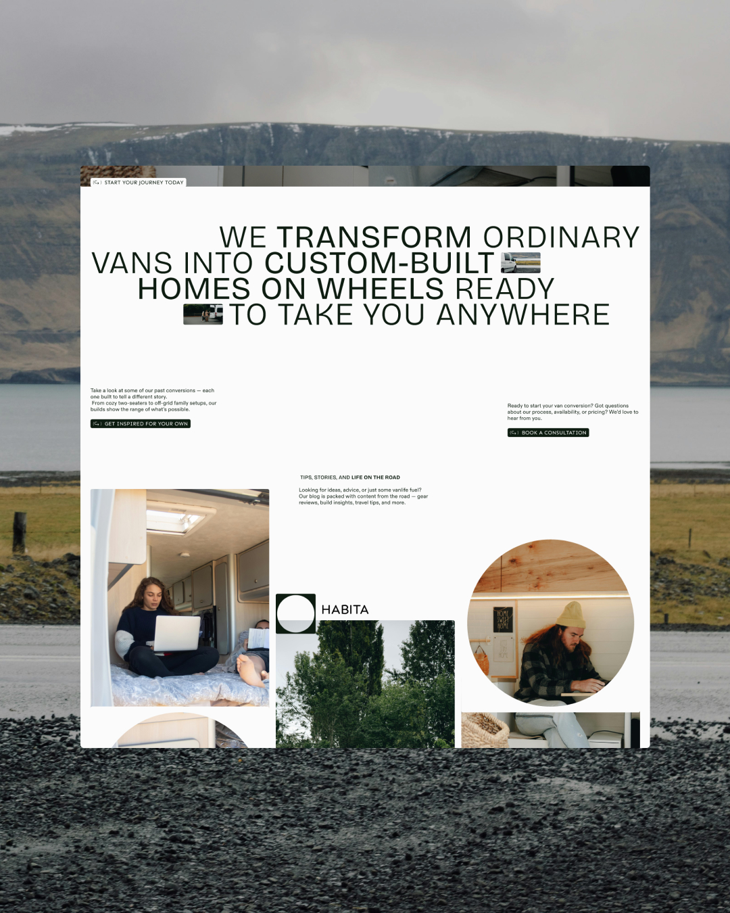
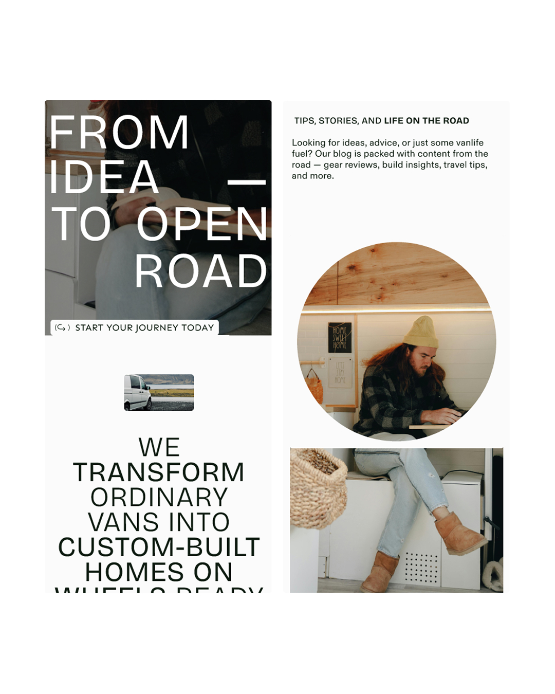
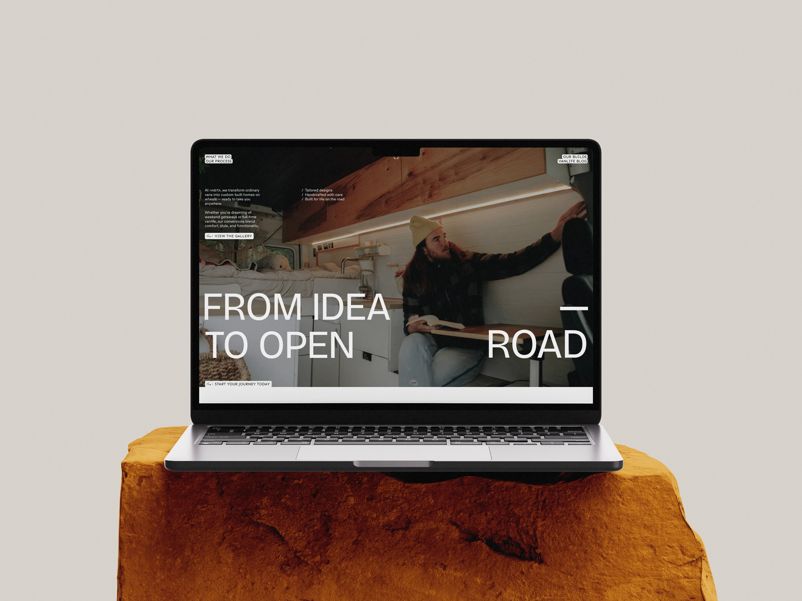

# Habita Landing page - Frontend Development

Habita’s new website — a company that turns vans into cozy homes on wheels. 

Clean, functional, and inspired by the freedom of the open road.

## Tech Stack

<!-- https://marwin1991.github.io/profile-technology-icons/ -->
